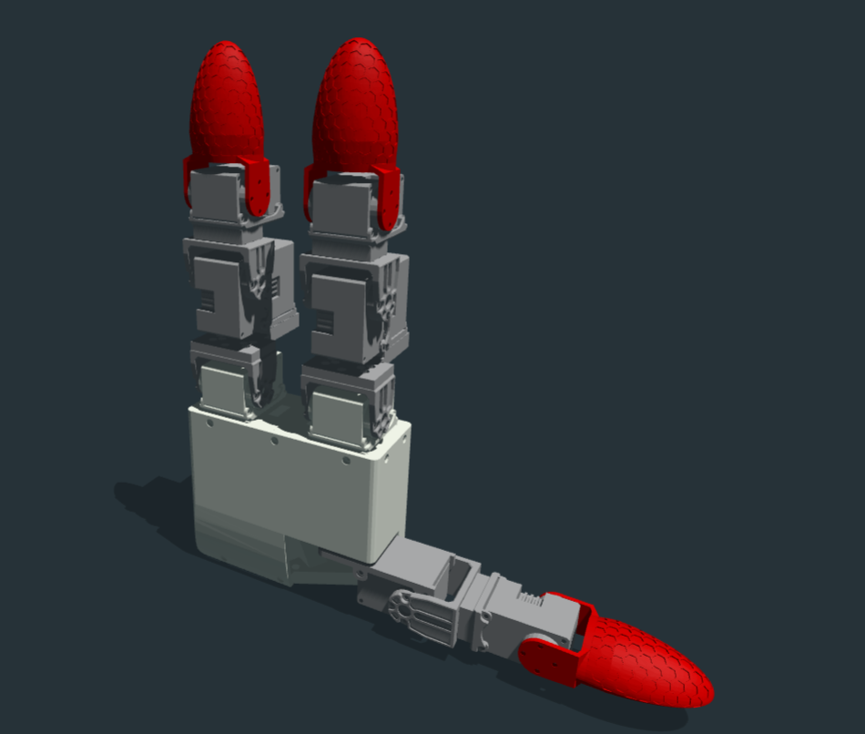
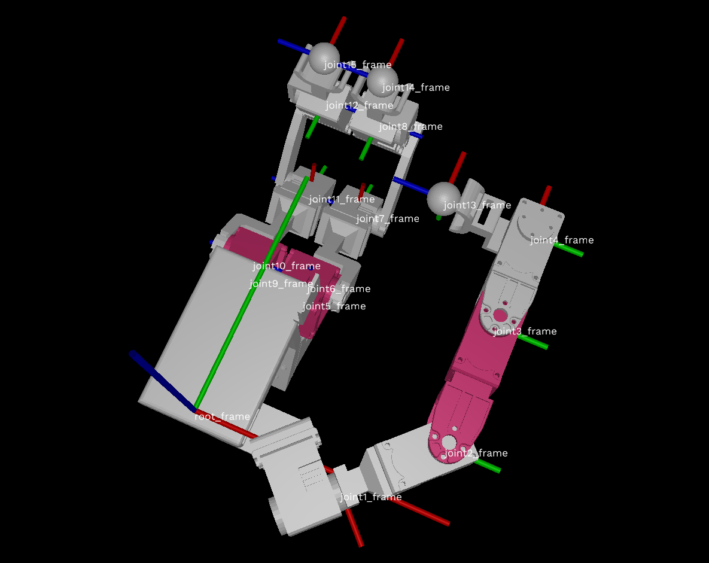

## Python Library to Control Dexterous Hand GX11 and Exoskeleton Glove EX12 
Libgex uses dynamixel SDK to control the motors in Python via OpenRB-150 control board through TTL at 1M bps. And libgex uses PyBullet to calculate the forward kinematics and inverse kinematics of the GX11 and EX12.

### Python Dependencies
```bash
pip install pyserial
pip install pybullet
```

### GX11 and EX12 URDF
Drag folder `libgex/gx11` or `libgex/ex11`  into http://urdf.robotsfan.com/ to visualize the URDF.

GX11 has 3 joints in finger1(thumb), 4 joints in finger2(index), 4 joints in finger3(middle).



Or use https://github.com/openrr/urdf-viz to visualize the URDF and display the link name and axes.

EX12 has 4 joints in finger1(thumb), 4 joints in finger2(index), 4 joints in finger3(middle).

The 4 joints design in thumb enable the exoskeleton glove to be better attached to the human thumb tip.



### Control GX11

```bash
python demo_gx11.py
```


### Control EX12
```bash
python demo_ex12.py
```

### Code Example
```bash
from libgex.libgx11 import Hand
import time
 
hand = Hand(port='/dev/ttyACM0') # COM* for Windows, ttyACM* or ttyUSB* for Linux, if in Linux, check the port number with `ls /dev/tty*`, then run `sudo chmod 777 /dev/ttyACM*`
hand.connect(goal_pwm=600) # will torque on all the motors, goal_pwm changes the speed, max 855

hand.home() # home the hand

hand.motors[0].setj(90) # unit degree

print(hand.getj()) # print all the joints angles in degree
```

```bash
from libgex.libex12 import Glove
from libgex.utils import search_ports
import time


port = search_ports()[0]
 
glove = Glove('/dev/ttyACM1') # COM* for Windows, ttyACM* or ttyUSB* for Linux, if in Linux, check the port number with `ls /dev/tty*`, then run `sudo chmod 777 /dev/ttyACM*`
glove.connect(init=False) # do not torque on glove yet.

print(glove.fk_finger1()) # get the thumb tip xyz position in base_link frame (bottom of the palm), unit m

```

All the contorl commands are in `libgex/libgx11.py` and `libgex/libex12.py`


### Hardware 

#### EX12

https://github.com/Democratizing-Dexterous/ExoskeletonGloveEX12

#### GX11

Coming soon...


### Acknowledgement

https://github.com/ROBOTIS-GIT/DynamixelSDK
